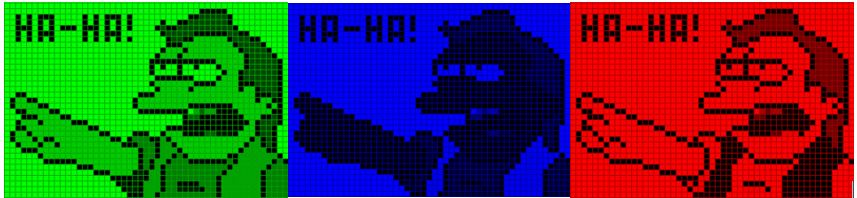
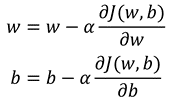

#### Q1 What are Channels and Kernels?

Before we try to decode Channels and Kernels in a digital image, lets first understand what is a digital image. A digital image is an array of numerical numbers known as pixels. Pixels are the smallest individual element in an image, holding antiquated values that represent the brightness of a given color at any specific point. 
Images are generally organized in two dimensions with the array starting at the top-left where the index is 0 and flows from left-to-right and top-to-bottom. In a color image, each pixel represents a color made up of three distinct numerical values. These distinct numerical values may represent the intensity of Red, Green and Blue light. The combination of these three intensity values gives each pixel its color. In any individual pixel, an intensity of 0 indicates no light in that channel for that pixel and an intensity of 255 indicates the maximum light in the channel for that pixel.      
       
Now, the kernel is nothing but a filter that is used to extract the features from the images. The kernel is a matrix that moves over the input data, performs the dot product with the sub-region of input data, and gets the output as the matrix of dot products.            

For Example, the given kernel, convolve over the 2D, single Channel Greyscale Image and sharpen the given image.               
            

 
#### Q2 Why should we (nearly) always use 3x3 kernels?

Conventionally we go for odd-sized filter kernels because they are symmetric around the origin, which is a good property.
Now we prefer 3*3 small convolution kernel stack instead of a large convolution kernel because 
•	3x3 It is the smallest size that can capture the information of the pixel's eight neighborhoods.
•	A large-sized convolution layer can be replaced by a stack of small-sized convolution layers. For example, a 5X5 kernel can be replaced by two 3X3 kernels
 

#### Q3 How many times do we need to perform 3x3 convolutions operations to reach close to 1x1 from 199x199 (type each layer output like 199x199 > 197x197...)?
It takes 99 Convolution to perform 3X3 convolutions to reach 1X1 from 199X199.

199x199 | 3x3 > 197x197         
197x197 | 3x3 > 195x195         
195x195 | 3x3 > 193x193         
193x193 | 3x3 > 191x191         
191x191 | 3x3 > 189x189         
189x189 | 3x3 > 187x187         
187x187 | 3x3 > 185x185         
185x185 | 3x3 > 183x183         
183x183 | 3x3 > 181x181         
181x181 | 3x3 > 179x179         
179x179 | 3x3 > 177x177         
177x177 | 3x3 > 175x175         
175x175 | 3x3 > 173x173         
173x173 | 3x3 > 171x171         
171x171 | 3x3 > 169x169         
169x169 | 3x3 > 167x167         
167x167 | 3x3 > 165x165         
165x165 | 3x3 > 163x163         
163x163 | 3x3 > 161x161         
161x161 | 3x3 > 159x159         
159x159 | 3x3 > 157x157         
157x157 | 3x3 > 155x155         
155x155 | 3x3 > 153x153         
153x153 | 3x3 > 151x151         
151x151 | 3x3 > 149x149         
149x149 | 3x3 > 147x147         
147x147 | 3x3 > 145x145         
145x145 | 3x3 > 143x143         
143x143 | 3x3 > 141x141         
141x141 | 3x3 > 139x139         
139x139 | 3x3 > 137x137         
137x137 | 3x3 > 135x135         
135x135 | 3x3 > 133x133         
133x133 | 3x3 > 131x131         
131x131 | 3x3 > 129x129         
129x129 | 3x3 > 127x127         
127x127 | 3x3 > 125x125         
125x125 | 3x3 > 123x123         
123x123 | 3x3 > 121x121         
121x121 | 3x3 > 119x119         
119x119 | 3x3 > 117x117         
117x117 | 3x3 > 115x115         
115x115 | 3x3 > 113x113         
113x113 | 3x3 > 111x111         
111x111 | 3x3 > 109x109         
109x109 | 3x3 > 107x107         
107x107 | 3x3 > 105x105         
105x105 | 3x3 > 103x103         
103x103 | 3x3 > 101x101         
101x101 | 3x3 > 99x99         
99x99   | 3x3 > 97x97         
97x97   | 3x3 > 95x95         
95x95   | 3x3 > 93x93         
93x93   | 3x3 > 91x91         
91x91   | 3x3 > 89x89         
89x89   | 3x3 > 87x87                
87x87   | 3x3 > 85x85         
85x85   | 3x3 > 83x83         
83x83   | 3x3 > 81x81         
81x81   | 3x3 > 79x79         
79x79   | 3x3 > 77x77         
77x77   | 3x3 > 75x75         
75x75   | 3x3 > 73x73         
73x73   | 3x3 > 71x71         
71x71   | 3x3 > 69x69         
69x69   | 3x3 > 67x67         
67x67   | 3x3 > 65x65         
65x65   | 3x3 > 63x63         
63x63   | 3x3 > 61x61         
61x61   | 3x3 > 59x59         
59x59   | 3x3 > 57x57         
57x57   | 3x3 > 55x55         
55x55   | 3x3 > 53x53         
53x53   | 3x3 > 51x51         
51x51   | 3x3 > 49x49         
49x49   | 3x3 > 47x47                  
47x47   | 3x3 > 45x45         
45x45   | 3x3 > 43x43         
43x43   | 3x3 > 41x41         
41x41   | 3x3 > 39x39         
39x39   | 3x3 > 37x37         
37x37   | 3x3 > 35x35         
35x35   | 3x3 > 33x33         
33x33   | 3x3 > 31x31                  
31x31   | 3x3 > 29x29         
29x29   | 3x3 > 27x27         
27x27   | 3x3 > 25x25         
25x25   | 3x3 > 23x23         
23x23   | 3x3 > 21x21         
21x21   | 3x3 > 19x19         
19x19   | 3x3 > 17x17         
17x17   | 3x3 > 15x15         
15x15   | 3x3 > 13x13         
13x13   | 3x3 > 11x11         
11x11   | 3x3 > 9x9         
9x9     | 3x3 > 7x7         
7x7     | 3x3 > 5x5         
5x5     | 3x3 > 3x3         
3x3     | 3x3 > 1x1         

 
#### Q4 How are kernels initialized? 

•	Before the advances in optimization techniques and activation of non-linearities, kernel is initializes from a random distribution. With advances, all the advances we are able to train convolutional neural networks from a randomized initialization.
•	Weights of the backpropagation will be randomly initialized such that the mean of the distribution weights is 0 and standard deviation of 1.
•	Potential Problems with Weight Initializations
•	If the weights are too small, then the signal shrinks as it passes through each layer. Ends up with very small value to use.
•	If the weights are too large, then the signal grows too large as it passes through each layer, which will bevery large by the time it ends
•	Xavier Initialization takes care of this problem. For more understanding on Xavier initialization below blog and vlog can be used.
https://andyljones.tumblr.com/post/110998971763/an-explanation-of-xavier-initialization
https://www.youtube.com/watch?v=8krd5qKVw-Q
Paper on Xavier Initialization: 
http://proceedings.mlr.press/v9/glorot10a/glorot10a.pdf
https://stats.stackexchange.com/questions/200513/how-to-initialize-the-elements-of-the-filter-matrix
https://stats.stackexchange.com/questions/267807/cnn-kernels-updates-initialization
https://www.quora.com/How-are-convolutional-filters-kernels-initialized-and-learned-in-a-convolutional-neural-network-CNN
https://ai.stackexchange.com/questions/5092/how-are-kernels-input-values-initialized-in-a-cnn-network#:~:text=The%20kernels%20are%20usually%20initialized,are%20many%20different%20initialization%20strategies.&text=For%20specific%20types%20of%20kernels,that%20seem%20to%20perform%20well.

#### Q5 What happens during the training of a DNN?
As the EVA 6 Course is focused towards Computer Vision. I will be answering the question taking Image data as context. Let us try to understand a simple example of Binary Classification problem; predict if a picture has a cat or not. 
First, we select the Activation Function; as the problem statement is Binary Classification, lets take Sigmoid Activation Function. Mathematically Sigmoid Function is expressed as               
    
Here z is defined as weighted input and is defined as:                 
                       
Where w is the weight matrix or importance of a feature and b is a bias(constant). Now, we need to initialize the weights and bias.                   
Now, we need to define a function for forward propagation and for backpropagation. During forward propagation, a series of calculations is performed to generate a prediction and to calculate the cost. The cost is a function that we wish to minimize            
                         

Where y is an observation and y_hat is a prediction.                    
Then, backpropagation calculates the gradient, or the derivatives. This will be useful during the optimization phase, because when the derivatives are close or equal to 0, it means that our parameters are optimized to minimize the cost function.                                                 
We need to repeat forward propagation and backpropagation to update the parameters in order to minimize the cost function. This is done using gradient descent. For that, we set a learning rate which is a small positive value that controls the magnitude of change of the parameters at each run.                          
                     
Now, we can train our model and make predictions!                

#### Submitted By:                        
GROUP 23                  
•	Jayasankar Raju S - muralis2raj@gmail.com               
•	Sarthak Dargan – sarthak221995@gmail.com               
•	CV Chiranthan - chiranthancv95@gmail.com               
•	Mayank Singhal - singhal.mayank77@gmail.com               

